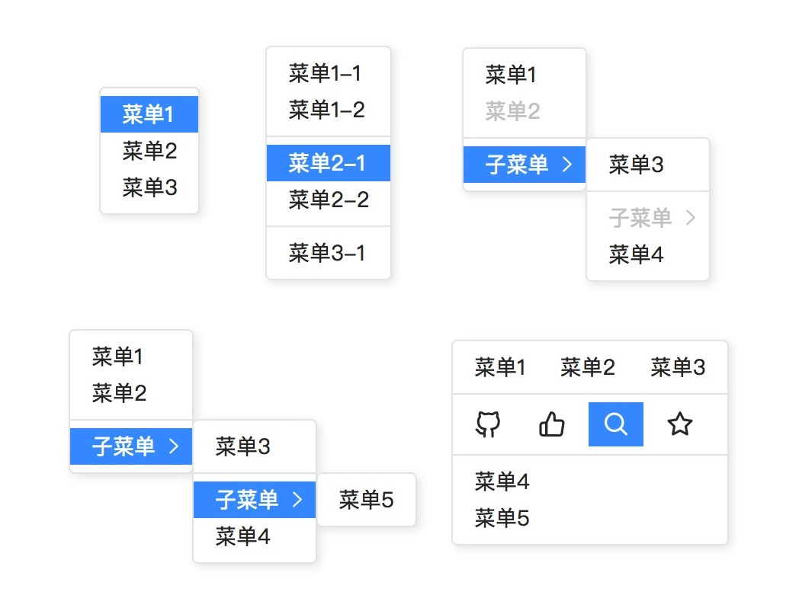
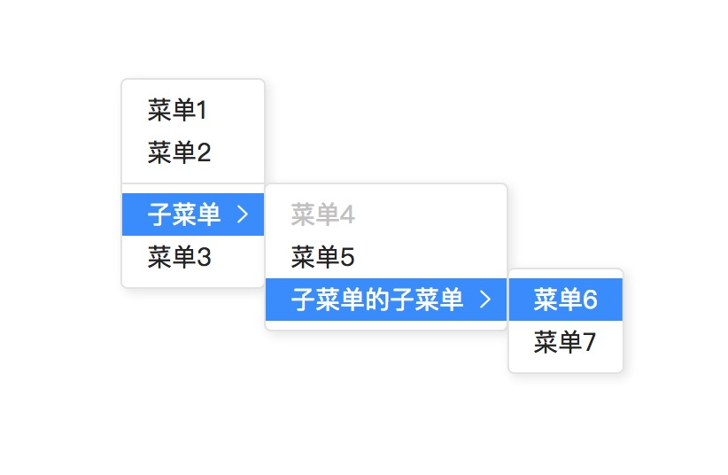
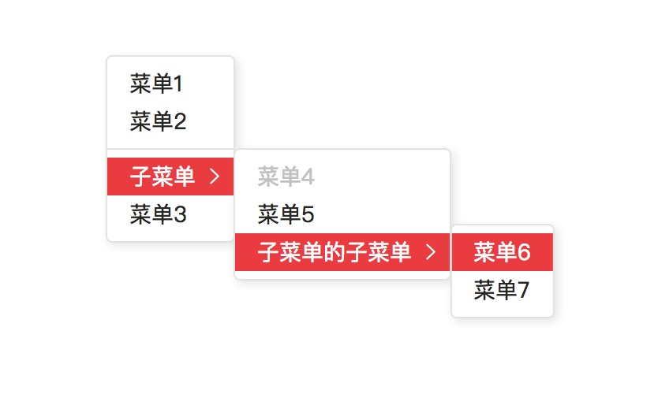
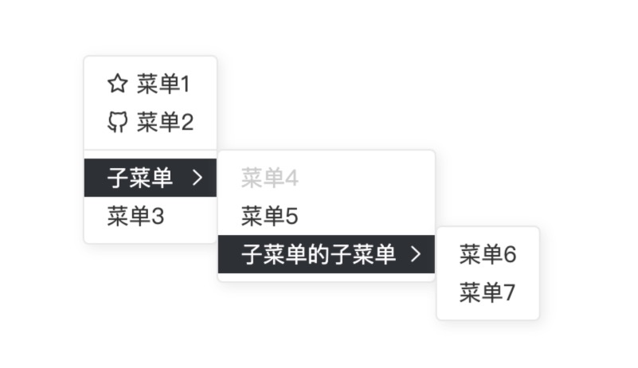

# v-contextmenu

[![NPM version][badge-npm-version]][url-npm]
[![Node version][badge-node-version]][url-npm]
[![NPM download][badge-npm-download]][url-npm]
![Dependencies][badge-dependencies]
![License][badge-license]

[![NPM][image-npm]][url-npm]

适用于 Vue 2.0 的 ContextMenu 组件。

**中文 | [English](./README_EN.md)**

## 安装

### CDN 引入

可通过 [unpkg.com/v-contextmenu](https://unpkg.com/v-contextmenu/) 获取最新版本的资源，在页面中引入相应 js 和 css 文件即可。

``` html
<!-- 引入 Vue -->
<script src="https://unpkg.com/vue/dist/vue.js"></script>

<!-- 引入 VContextmenu 组件 -->
<script src="https://unpkg.com/v-contextmenu/dist/index.js"></script>

<!-- 引入 VContextmenu 组件样式 -->
<link rel="stylesheet" href="https://unpkg.com/v-contextmenu/dist/index.css">
```

> 建议使用 NPM 安装

### NPM 安装

```bash
$ npm i -S v-contextmenu # yarn add v-contextmenu
```

## 概览



[访问在线示例](https://heynext.github.io/v-contextmenu) 或 [查看在线示例 GIF](./docs/images/example.gif)

## 使用

一个简单的例子

```javascript
import contentmenu from 'v-contextmenu'
import 'v-contextmenu/dist/index.css'

Vue.use(contentmenu)
```

```html
<template>
  <v-contextmenu ref="contextmenu">
    <v-contextmenu-item>菜单1</v-contextmenu-item>
    <v-contextmenu-item>菜单2</v-contextmenu-item>
    <v-contextmenu-item>菜单3</v-contextmenu-item>
  </v-contextmenu>

  <div v-contextmenu:contextmenu>右键点击此区域</div>
</template>
```

详细使用方法见 [文档](./docs/usage.md) & [例子](./examples)

> 如果你需要单独引入组件使用，请查看[单独引用](./examples/Stoneless.vue)

## 主题

提供三种主题，使用方法见 [VContextmenu](./docs/usage.md#vcontextmenu)

**默认**



**亮色**



**暗色**



## 开发

```bash
$ npm install
$ npm run dev
```

## 构建

```bash
$ npm run build:package # 构建 npm 包
$ npm run build:example # 构建示例站点
$ npm run build # build:package & build:example
```

## 更新日志

详见 [releases][url-releases]


[badge-npm-version]: https://img.shields.io/npm/v/v-contextmenu.svg
[badge-node-version]: https://img.shields.io/node/v/v-contextmenu.svg
[badge-npm-download]: https://img.shields.io/npm/dt/v-contextmenu.svg
[badge-license]: https://img.shields.io/github/license/heynext/v-contextmenu.svg
[badge-dependencies]: https://img.shields.io/david/dev/heynext/v-contextmenu.svg

[url-npm]: https://npmjs.org/package/v-contextmenu
[url-dependencies]: https://david-dm.org/vkbansal/v-contextmenu
[url-releases]: https://github.com/heynext/v-contextmenu/releases

[image-npm]: https://nodei.co/npm/v-contextmenu.png
