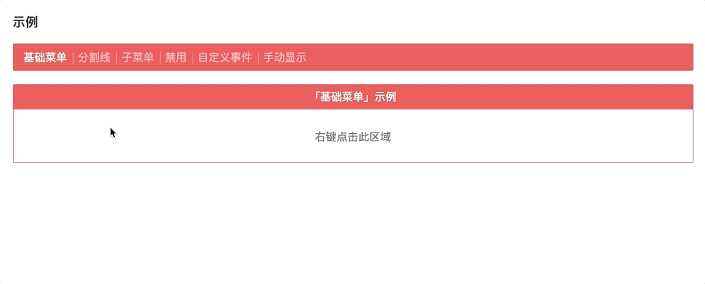

# v-contextmenu

适用于 Vue 2.0 的 ContextMenu 组件。

## 安装

```bash
$ yarn add v-contextmenu # npm i -S v-contextmenu
```

## 在线示例

https://xbt1.github.io/v-contextmenu



## 使用

一个简单的例子

```javascript
import 'v-contextmenu'
import 'v-contextmenu/dist/assets/styles/index.css'
```

```html
<template>
  <v-contextmenu ref="contextmenu">
    <v-contextmenu-item>菜单1</v-contextmenu-item>
    <v-contextmenu-item>菜单2</v-contextmenu-item>
    <v-contextmenu-item>菜单3</v-contextmenu-item>
  </v-contextmenu>

  <div v-contextmenu:contextmenu>右键点击此区域</div>
</template>
```

详细使用方法见 [文档](./docs/usage.md) & [例子](./examples)

## 开发

```bash
$ yarn install
$ yanr dev
```

## 构建

```bash
$ yarn build:package # 构建 npm 包
$ yarn build:example # 构建示例站点
$ yarn build # build:package & build:example
```
