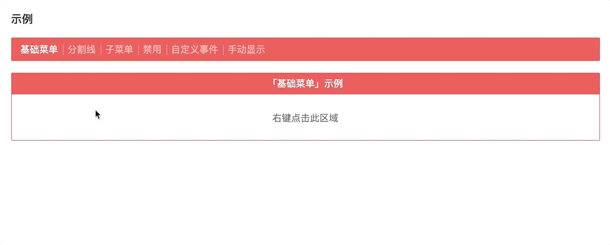

# v-contextmenu

[![NPM version][badge-npm-version]][url-npm]
[![Node version][badge-node-version]][url-npm]
[![NPM download][badge-npm-download]][url-npm]
![Dependencies][badge-dependencies]
![License][badge-license]

[![NPM][image-npm]][url-npm]

ContextMenu component for Vue 2.0.

**English | [中文](./README.md)**

## Installation

```bash
$ yarn add v-contextmenu # npm i -S v-contextmenu
```

## Live Examples

https://xbt1.github.io/v-contextmenu



## Usage

A simple example

```javascript
import 'v-contextmenu'
import 'v-contextmenu/dist/index.css'
```

```html
<template>
  <v-contextmenu ref="contextmenu">
    <v-contextmenu-item>Menu Item 1</v-contextmenu-item>
    <v-contextmenu-item>Menu Item 2</v-contextmenu-item>
    <v-contextmenu-item>Menu Item 3</v-contextmenu-item>
  </v-contextmenu>

  <div v-contextmenu:contextmenu>Right click here</div>
</template>
```

See [usage](./docs/usage.md) & [examples](./examples) for more details.

## Theme

There are two themes，see [VContextmenu](./docs/usage.md#vcontextmenu) for more details.

**Default**


**Bright**


## Develop

```bash
$ yarn install
$ yarn dev
```

## Build

```bash
$ yarn build:package # Build for npm
$ yarn build:example # Build for site
$ yarn build # build:package & build:example
```

## Changelog

See [releases][url-releases]


[badge-npm-version]: https://img.shields.io/npm/v/v-contextmenu.svg
[badge-node-version]: https://img.shields.io/node/v/v-contextmenu.svg
[badge-npm-download]: https://img.shields.io/npm/dt/v-contextmenu.svg
[badge-license]: https://img.shields.io/github/license/xbt1/v-contextmenu.svg
[badge-dependencies]: https://img.shields.io/david/dev/xbt1/v-contextmenu.svg

[url-npm]: https://npmjs.org/package/v-contextmenu
[url-dependencies]: https://david-dm.org/vkbansal/v-contextmenu
[url-releases]: https://github.com/XBT1/v-contextmenu/releases

[image-npm]: https://nodei.co/npm/v-contextmenu.png
