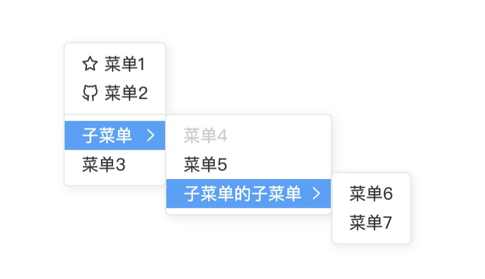
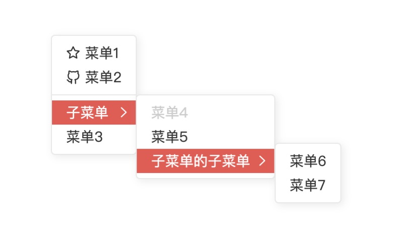
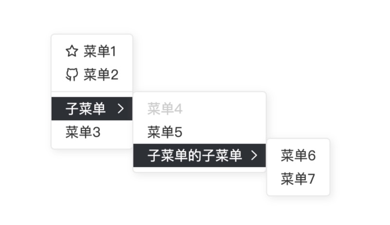

# v-contextmenu

## Startup

All components as follows：

- [`VContextmenu`](#vcontextmenu)
- [`VContextmenuItem`](#vcontextmenuitem)
- [`VContextmenuSubmenu`](#vcontextmenusubmenu)
- [`VContextmenuGroup`](#vcontextmenugroup)

and a directive：

- [`v-contextmenu`](#v-contextmenuref)

## Directive：

#### `v-contextmenu:ref`

`ref` is an instance of `VContextmenu`，for example:

```html
<v-contextmenu ref="contextmenu">
  <v-contextmenu-item>Menu</v-contextmenu-item>
</v-contextmenu>

<div v-contextmenu:contextmenu></div>
```

## Components

#### `VContextmenu`

Base Contextmenu Component

**Attributes**

| Attribute  | Description   | Type   | Options    | Default       |
| ---------- | ------------- | ------ | ---------- | ------------- |
| eventType  | event to bind | String | any events | contextmenu   |
| theme      | theme         | String | default / bright / dark | default |
| disabled   | disable the Menu (will not appear)  | Boolean | true / false | false |
| autoPlacement  | whether change placement automatically when the Menu is outside of Window | Boolean | true / false | true |

**Methods**

| Method Name | Description    | Arguments     |
| ----------- | -------------- | ------------- |
| show        | show the Menu  | `{ top: number, left: number }`，both `top` & `left` are the relative value to browser |
| hide        | hide the Menu  | -- |
| hideAll     | hide all Menus | -- |

**Events**

| Event Name  | Description                  | Parameters       |
| ----------- | ---------------------------- | ---------------- |
| show        | triggers when the Menu shows | `vm` of the Menu |
| hide        | triggers when the Menu hides | `vm` of the Menu |
| contextmenu | triggers when `contextmenu` event triggered | `vnode` of the element that triggers `contextmenu` event |

> see more about [vnode](https://vuejs.org/v2/api/#VNode-Interface)

#### `VContextmenuItem`

Component for menu items，only used within `VContextmenu`, `VContextmenuGroup` or `VContextmenuSubmenu`

**Attributes**

| Attribute  | Description            | Type    | Options      | Default |
| ---------- | ---------------------- | ------- | ------------ | ------- |
| divider    | whether a divider menu | Boolean | true / false | false   |
| disabled   | whether disabled       | Boolean | true / false | false   |
| autoHide   | whether hide menu when clicked   | Boolean | true / false | true   |

**Events**

| Event Name | Description        | Parameters     |
| ---------- | ------------------ | -------------- |
| click      | triggers when the Menuitem clicked  | the first parameter is `vm`, the second is `event` |
| mouseenter | triggers when mouse enter the Menuitem | the first parameter is `vm`, the second is `event` |
| mouseleave | triggers when mouse leave the Menuitem | the first parameter is `vm`, the second is `event` |

#### `VContextmenuSubmenu`

Component for submenus，able to be nested

**Attributes**

| Attribute | Description      | Type    | Options | Default |
| --------- | ---------------- | ------- | ------- | ------- |
| title     | submenu's title  | String  | --      | --      |
| disabled  | whether disabled | Boolean | true / false | false |

**Events**

| Event Name | Description        | Parameters     |
| ---------- | ------------------ | -------------- |
| mouseenter | triggers when mouse enter the Menuitem | the first parameter is `vm`, the second is `event` |
| mouseleave | triggers when mouse leave the Menuitem | the first parameter is `vm`, the second is `event` |

**Slots**

| Slot Name | Description                                |
| --------- | ------------------------------------------ |
| title     | submenu's title，same as `title` attribute |

#### `VContextmenuGroup`

Component for menu group, `VContextmenuItem` can be nested

**Attributes**

| Attribute | Description | Type            | Options | Default |
| --------- | ----------- | --------------- | ------- | ----- |
| maxWidth  | max width   | Number / String | --      | --    |

## Themes

There are three themes as follows:

**Default**



**Bright**



**Dark**



Furthermore, you can cover the default styles using following `classnames`

- `v-contextmenu`: Root element
- `v-contextmenu--default`: Root element - default theme
- `v-contextmenu--bright`: Root element - bright theme
- `v-contextmenu--dark`: Root element - dark theme
- `v-contextmenu-item`: Menu item
- `v-contextmenu-item--hover`: Menu item when hover
- `v-contextmenu-item--disabled`: Menu item when disabled
- `v-contextmenu-divider`: Menu item with the `divider` attribute
- `v-contextmenu-group`: MenuGroup's root element
- `v-contextmenu-group__menus`: Menus' wrapper of MenuGroup
- `v-contextmenu-submenu`: Submenu's wrapper
- `v-contextmenu-submenu__title`: Title of submenu
- `v-contextmenu-submenu__icon`: Icon of submenu
